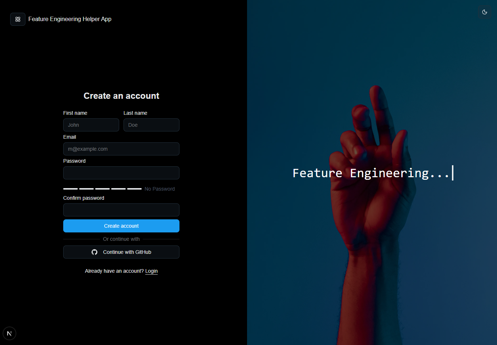
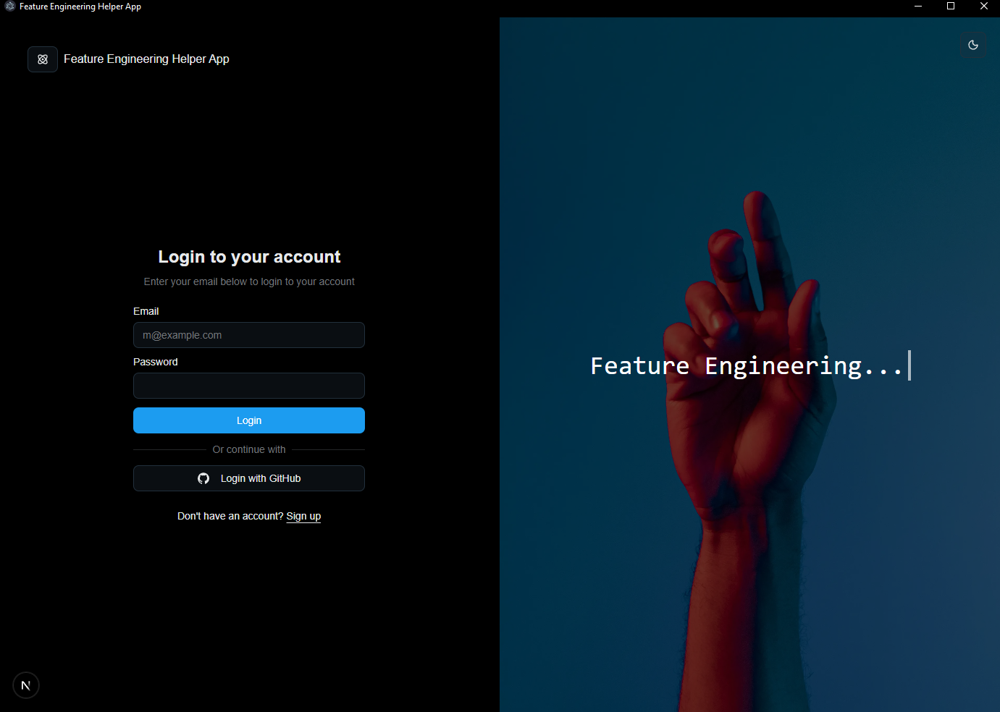
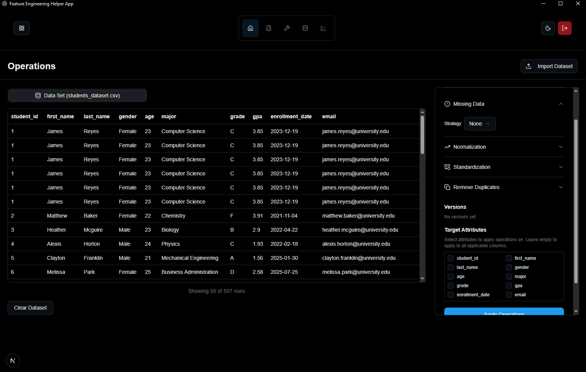
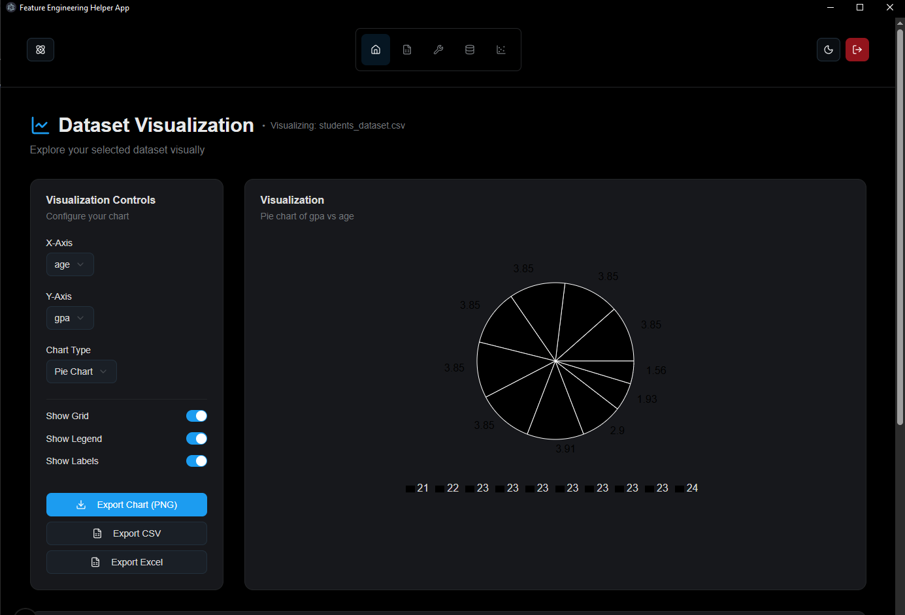

# 🚀 Feature Engineering Helper App

A powerful desktop application for **automated dataset preprocessing, visualization, and fusion** — built with **Next.js**, **FastAPI**, and **Electron**.


## 📋 Table of Contents

- [Overview](#overview)
- [Features](#features)
- [Tech Stack](#tech-stack)
- [Prerequisites](#prerequisites)
- [Installation](#installation)
- [Running the Application](#running-the-application)
- [Project Structure](#project-structure)
- [API Documentation](#api-documentation)
- [Screenshots](#screenshots)

---

## 🎯 Overview

This application helps data scientists and machine learning engineers streamline their data preprocessing workflow. Upload CSV/Excel files, apply cleaning operations, visualize insights, and fuse multiple datasets — all in an intuitive desktop interface.

---

## ✨ Features

### 🔐 User Authentication
- **Secure registration and login** with password hashing
- **Session management** with local storage

### 📊 Dataset Management
- **Upload CSV and Excel files**
- **View dataset metadata** (rows, columns, data types)
- **Dataset preview** with scrollable tables
- **Download processed datasets**

### 🛠️ Data Preprocessing (Operations)
- **Remove duplicates**
- **Handle missing values** (mean, median, mode, drop)
- **Normalization** (Min-Max scaling)
- **Standardization** (Z-score scaling)
- **Real-time preview** of cleaned data

### 🔗 Dataset Fusion
- **Merge multiple datasets** with schema validation
- **Automatic type checking** to prevent incompatible merges
- **Export fused datasets** as CSV or Excel

### 📈 Data Visualization
- **Multiple chart types**: Line, Bar, Pie, Scatter, Area, Radar, Histogram
- **Interactive controls** for X/Y axis selection
- **Export charts** as PNG images
- **Export data** as CSV or Excel

---

## 🛠️ Tech Stack

### Frontend (Client)
- **Next.js 15** - React framework with App Router
- **TypeScript** - Type-safe development
- **Tailwind CSS** - Utility-first styling
- **Shadcn/UI** - Modern UI components
- **Recharts** - Data visualization library
- **Zustand** - State management
- **Electron** - Desktop app framework
- **Framer Motion** - Animations

### Backend (Server)
- **FastAPI** - Modern Python web framework
- **SQLAlchemy** - ORM for database operations
- **Pandas** - Data manipulation and analysis
- **Scikit-learn** - Machine learning preprocessing
- **Bcrypt** - Password hashing
- **SQLite** - Database

---

## 📦 Prerequisites

Before you begin, ensure you have the following installed:

- **Node.js** (v18 or higher)
- **npm** or **yarn**
- **Python** (v3.8 or higher)
- **pip** (Python package manager)

---

## 💻 Installation

### 1. Clone the Repository

```bash
git clone https://github.com/faroukq1/feature-engineering-helper-app.git
cd feature-engineering-helper-app
```

### 2. Install Client Dependencies

```bash
cd client
npm install
```

### 3. Install Server Dependencies

```bash
cd ../server

# Create a virtual environment
python -m venv venv

# Activate the virtual environment
# On Windows:
venv\Scripts\activate
# On macOS/Linux:
# source venv/bin/activate

# Install dependencies
pip install -r requirements.txt
```

---

## 🚀 Running the Application

### Option 1: Run Both Client and Server Separately

#### Terminal 1 - Start the Backend Server

```bash
cd server

# Activate virtual environment first
# On Windows:
venv\Scripts\activate
# On macOS/Linux:
# source venv/bin/activate

# Start the server
uvicorn app.main:app --reload --port 8000
```

The API will be available at `http://localhost:8000`

#### Terminal 2 - Start the Frontend (Electron Desktop App)

```bash
cd client
npm run dev
```

This will start:
- Next.js dev server at `http://localhost:3000`
- Electron desktop app window

### Option 2: Production Build

```bash
# Build the Next.js app
cd client
npm run build

# Start production server
npm run start
```

---

## 📁 Project Structure

```
feature-engineering-helper-app/
├── client/                    # Frontend (Next.js + Electron)
│   ├── app/                   # Next.js App Router
│   │   ├── (auth)/           # Authentication pages
│   │   │   ├── login/
│   │   │   └── register/
│   │   ├── dashboard/        # Main dashboard
│   │   │   ├── create/       # Create datasets manually
│   │   │   ├── operations/   # Data preprocessing
│   │   │   ├── fusion/       # Dataset fusion
│   │   │   └── visualization/ # Data visualization
│   │   └── page.tsx          # Landing page
│   ├── components/           # Reusable UI components
│   ├── store/               # Zustand state management
│   ├── electron/            # Electron configuration
│   └── package.json
│
├── server/                   # Backend (FastAPI)
│   ├── app/
│   │   ├── main.py          # API routes and endpoints
│   │   ├── models.py        # Database models
│   │   └── database.py      # Database configuration
│   ├── downloads/           # Uploaded files storage
│   ├── database.db          # SQLite database
│   └── requirements.txt
│
├── pictures/                # Screenshots for documentation
└── README.md
```

---

## 📡 API Documentation

### Authentication Endpoints

#### Register User
```http
POST /users/
Content-Type: application/json

{
  "firstname": "John",
  "lastname": "Doe",
  "email": "john@example.com",
  "password": "securepassword"
}
```



```python
@app.post("/users/")
def create_user(user: UserCreate, db: Session = Depends(get_db)):
    # 1️⃣ Check if the email already exists in the database
    existing_user = db.query(models.User).filter(models.User.email == user.email).first()
    if existing_user:
        raise HTTPException(status_code=400, detail="Email already registered")

    # 2️⃣ Hash the password before saving it
    hashed_pw = hash_password(user.password)

    # 3️⃣ Create a new user object with hashed password
    new_user = models.User(
        firstname=user.firstname,
        lastname=user.lastname,
        email=user.email,
        password=hashed_pw
    )

    # 4️⃣ Add and commit the user to the database
    db.add(new_user)
    db.commit()
    db.refresh(new_user)

    # 5️⃣ Return a success message
    return {"message": f"User {new_user.firstname} created successfully", "user_id": new_user.id}
```

### 🔍 Important Lines Explained:

- **`existing_user = db.query(...).first()`** → checks if the email is already registered to prevent duplicates.
- **`hashed_pw = hash_password(user.password)`** → converts the plain password into a secure hash (protects against leaks).
- **`db.add(new_user); db.commit()`** → saves the new user permanently in the database.
- **`db.refresh(new_user)`** → updates the object with the new database data (like generated ID).
- **`return {...}`** → sends a success message and user ID back to the client.

✅ **Security point:** Password hashing is the key protection here — it ensures passwords aren’t stored in plain text, making it safe even if the database is exposed.



```python
@app.post("/login")
def login(user: UserLogin, db: Session = Depends(get_db)):
    # 1️⃣ Find user by email in the database
    db_user = db.query(models.User).filter(models.User.email == user.email).first()
    if not db_user:
        raise HTTPException(status_code=400, detail="Invalid email or password")

    # 2️⃣ Verify if the entered password matches the hashed one
    if not verify_password(user.password, db_user.password):
        raise HTTPException(status_code=400, detail="Invalid email or password")

    # 3️⃣ Return basic user info if login is successful
    return {
        "id": db_user.id,
        "firstname": db_user.firstname,
        "lastname": db_user.lastname,
        "email": db_user.email
    }
```

### 🔍 Important Lines Explained:

- **`db_user = db.query(...).first()`** → searches the database for a user with the given email.
- **`if not db_user:`** → returns an error if the email doesn’t exist.
- **`verify_password(user.password, db_user.password)`** → compares the plain password with the stored **hashed password** to check if it’s correct (this is the key security step).
- **`return {...}`** → sends back basic user info if authentication succeeds.

✅ **Security point:** The password is never stored or compared in plain text. Instead, it’s verified using a hash function, keeping users’ credentials safe even if the database is compromised.


```python
@app.post('/jsonify-dataset')
async def jsonify_dataset(file: UploadFile = File(...)):
    # 1️⃣ Read the uploaded file content
    content = await file.read()
    file_extension = file.filename.rsplit('.', 1)[-1].lower()

    # 2️⃣ Check the file type and load it into a DataFrame
    if file_extension == 'csv':
        df = pd.read_csv(io.BytesIO(content))
    elif file_extension in ['xls', 'xlsx']:
        df = pd.read_excel(io.BytesIO(content))
    else:
        return {'error': "Please upload CSV or Excel (.xlsx)"}

    # 3️⃣ Make the DataFrame JSON-safe (cleaning for compatibility)
    df = make_dataframe_json_safe(df)

    # 4️⃣ Convert the DataFrame to JSON format and return it
    return df.to_dict(orient='records')
```

### 🔍 Step-by-Step Explanation:

1. **File Upload from Dashboard:**
   When you click “Add new file” on your dashboard, the selected file (CSV or Excel) is sent to this API endpoint (`/jsonify-dataset`).

2. **Reading the File:**
   The line `content = await file.read()` reads the entire uploaded file into memory.

3. **Detecting File Type:**
   The file’s extension (like `.csv` or `.xlsx`) is extracted using `file.filename.rsplit('.', 1)[-1].lower()`.

   - If it’s a **CSV**, it loads using `pd.read_csv()`.
   - If it’s an **Excel file**, it loads using `pd.read_excel()`.
   - Otherwise, it returns an error message.

4. **Cleaning Data for JSON:**
   `make_dataframe_json_safe(df)` prepares the data to be safely converted to JSON — for example, by removing unsupported types or fixing NaN values.

5. **Returning the Data as JSON:**
   Finally, `df.to_dict(orient='records')` transforms the dataset into a list of dictionaries (JSON objects), making it ready for **preprocessing, visualization, or fusion** on your dashboard.



```python
@app.post("/json-process")
async def process_file(data: List[Dict[str, Any]], config: dict = None):
    # 1️⃣ Convert uploaded JSON data to DataFrame
    df = pd.DataFrame(data)
    df = make_dataframe_json_safe(df)
    df = df.replace({np.nan: None})

    # 2️⃣ Apply preprocessing configuration if provided
    parsed_config = None
    if config:
        parsed_config = DataProcessingConfig(**config)
        df = preprocess_dataframe(df, parsed_config)
        df = make_dataframe_json_safe(df)
        df = df.replace({np.nan: None})

    # 3️⃣ Return processed dataset as JSON
    return {
        "config": parsed_config.model_dump() if parsed_config else None,
        "data": df.to_dict(orient="records"),
        "row_count": len(df)
    }
```

### 🔍 Explanation

This endpoint receives a dataset in JSON format from the dashboard and prepares it for preprocessing. It first converts the JSON array into a **pandas DataFrame** for easier manipulation. If the user provides preprocessing options (like normalization or handling missing values), it creates a configuration object and sends the DataFrame to the `preprocess_dataframe` function to apply these operations. Finally, it returns the cleaned and processed data back in JSON format so it can be used directly in the app.

---

```python
def preprocess_dataframe(df: pd.DataFrame, config) -> pd.DataFrame:
    # Remove duplicates
    if getattr(config, "remove_duplicate", False):
        df = df.drop_duplicates()

    # Normalize numeric columns
    if getattr(config, "normalization", False):
        numeric_cols = df.select_dtypes(include=['number']).columns
        df[numeric_cols] = MinMaxScaler().fit_transform(df[numeric_cols])

    # Standardize numeric columns
    if getattr(config, "standardization", False):
        numeric_cols = df.select_dtypes(include=['number']).columns
        df[numeric_cols] = StandardScaler().fit_transform(df[numeric_cols])

    # Handle missing data
    if getattr(config, "missing_data", None):
        df = handle_missing_data(df, config.missing_data.dict())

    return df
```

### 🔍 Explanation

This function applies the selected **data preprocessing operations** safely.

- It first removes duplicate rows if the user enabled that option.
- Then it can **normalize** or **standardize** numeric columns to make them comparable.
- Finally, it calls `handle_missing_data()` to fill or remove missing values according to the user’s configuration.

✅ Together, these two functions automate the whole preprocessing step — from raw uploaded data to a clean, structured dataset ready for analysis or visualization.


```python
@app.post("/fuse-datasets")
def fuse_datasets(req: FusionRequest, db: Session = Depends(get_db)):
    """
    Fuse multiple datasets by validating schema compatibility.
    Returns can_fuse flag, diagnostics, and fused data when possible.
    """
    # 1️⃣ Load datasets (from DB or raw data)
    datasets: List[List[Dict[str, Any]]] = []

    if req.file_ids:
        files = db.query(UserFile).filter(UserFile.file_id.in_(req.file_ids)).all()
        datasets = [f.file_data or [] for f in files]
    elif req.datasets:
        datasets = req.datasets

    # 2️⃣ Extract schema from first dataset
    def get_schema(ds):
        keys = list(ds[0].keys())
        types = {k: _infer_type(next((row.get(k) for row in ds if row.get(k)), None))
                 for k in keys}
        return keys, types

    base_keys, base_types = get_schema(datasets[0])

    # 3️⃣ Validate schema compatibility
    can_fuse = True
    diagnostics = []

    for idx, ds in enumerate(datasets[1:], start=1):
        keys, types = get_schema(ds)

        if set(keys) != set(base_keys):
            can_fuse = False
            diagnostics.append(f"Dataset {idx} columns mismatch")

        for col in set(base_keys) & set(keys):
            if base_types[col] != types[col]:
                can_fuse = False
                diagnostics.append(f"Column '{col}' type mismatch")

    # 4️⃣ Fuse if compatible
    if can_fuse:
        fused = []
        for ds in datasets:
            for row in ds:
                fused.append({k: row.get(k) for k in base_keys})

        return {
            "can_fuse": True,
            "diagnostics": diagnostics,
            "schema": {"columns": base_keys, "types": base_types},
            "row_count": len(fused),
            "data": fused,
        }

    return {"can_fuse": False, "diagnostics": diagnostics}
```

### 🔍 Explanation

This endpoint enables **intelligent dataset fusion** with strict validation:

- **Step 1**: Loads datasets either from the database (using `file_ids`) or accepts raw JSON data
- **Step 2**: Extracts the schema (column names and data types) from the first dataset as the reference
- **Step 3**: Validates that all other datasets have identical schemas (same columns and types)
- **Step 4**: If compatible, concatenates all rows into a single unified dataset

✅ **Key benefit:** Prevents data corruption by ensuring only compatible datasets are merged. Returns detailed diagnostics if fusion fails.

---




Here’s how you can present it in your report 👇

---

### 📄 Code: `VisualizePage.tsx`

```tsx
"use client";

import { useState, useRef, useEffect } from "react";
import { Card, CardContent } from "@/components/ui/card";
import { LineChartIcon } from "lucide-react";
import Papa from "papaparse";
import * as XLSX from "xlsx";
import {
  LineChart,
  Line,
  BarChart,
  Bar,
  ScatterChart,
  Scatter,
  PieChart,
  Pie,
  Cell,
  XAxis,
  YAxis,
  CartesianGrid,
  Tooltip,
  Legend,
  ResponsiveContainer,
  AreaChart,
  Area,
  RadarChart,
  PolarGrid,
  PolarAngleAxis,
  PolarRadiusAxis,
  Radar,
  ComposedChart,
} from "recharts";
import { useDatasetStore } from "@/store/useDatasetStore";
import {
  VisualizationHeader,
  UploadPanel,
  ControlsPanel,
  ExportButtons,
  ChartCard,
  DataPreviewTable,
} from "./_components";

export default function VisualizePage() {
  const { visualizeDataset, selectedDataset, datasets } = useDatasetStore();
  const [dataset, setDataset] = useState<any[]>([]);
  const [columns, setColumns] = useState<string[]>([]);
  const [fileName, setFileName] = useState<string>("");
  const [xAxis, setXAxis] = useState<string>("");
  const [yAxis, setYAxis] = useState<string>("");
  const [chartType, setChartType] = useState("line");
  const [showGrid, setShowGrid] = useState(true);
  const [showLegend, setShowLegend] = useState(true);
  const [showLabels, setShowLabels] = useState(true);
  const fileInputRef = useRef<HTMLInputElement>(null);
  const chartRef = useRef<HTMLDivElement>(null);

  // Load dataset from store
  useEffect(() => {
    const source =
      visualizeDataset ??
      selectedDataset ??
      (datasets && datasets.length > 0 ? datasets[0] : null);

    if (source && source.data && source.data.length > 0) {
      setDataset(source.data);
      setFileName(source.dataset_name);
      const cols = Object.keys(source.data[0] || {});
      setColumns(cols);
      if (cols.length > 0) setXAxis(cols[0]);
      if (cols.length > 1) setYAxis(cols[1]);
    }
  }, [visualizeDataset, selectedDataset, datasets]);

  // Handle CSV file upload and parsing
  const handleFileUpload = (file: File) => {
    setFileName(file.name);
    Papa.parse(file, {
      header: true,
      dynamicTyping: true,
      complete: (results) => {
        if (results.data && results.data.length > 0) {
          setDataset(results.data);
          const cols = Object.keys(results.data[0]);
          setColumns(cols);
          if (cols.length > 0) setXAxis(cols[0]);
          if (cols.length > 1) setYAxis(cols[1]);
          setTimeout(() => {
            chartRef.current?.scrollIntoView({ behavior: "smooth" });
          }, 100);
        }
      },
      error: (error) => console.error("Error parsing CSV:", error),
    });
  };

  // Export functions (CSV, Excel, PNG)
  const exportToCSV = () => {
    const csv = Papa.unparse(dataset);
    const blob = new Blob([csv], { type: "text/csv" });
    const a = document.createElement("a");
    a.href = URL.createObjectURL(blob);
    a.download = `${fileName.replace(".csv", "")}_export.csv`;
    a.click();
  };

  const exportToExcel = () => {
    const ws = XLSX.utils.json_to_sheet(dataset);
    const wb = XLSX.utils.book_new();
    XLSX.utils.book_append_sheet(wb, ws, "Data");
    XLSX.writeFile(wb, `${fileName.replace(".csv", "")}_export.xlsx`);
  };

  // Prepare data for chart rendering
  const prepareChartData = () => {
    if (!xAxis || !yAxis || dataset.length === 0) return [];
    return dataset.map((row) => ({
      [xAxis]: row[xAxis],
      [yAxis]: Number(row[yAxis]) || 0,
    }));
  };

  // Render chart based on type
  const renderChart = () => {
    const data = prepareChartData();
    if (data.length === 0) return null;
    const commonProps = {
      data,
      margin: { top: 20, right: 30, left: 20, bottom: 20 },
    };

    switch (chartType) {
      case "line":
        return (
          <ResponsiveContainer width="100%" height={400}>
            <LineChart {...commonProps}>
              <CartesianGrid strokeDasharray="3 3" />
              <XAxis dataKey={xAxis} />
              <YAxis />
              <Tooltip />
              {showLegend && <Legend />}
              <Line
                type="monotone"
                dataKey={yAxis}
                stroke="hsl(var(--chart-1))"
              />
            </LineChart>
          </ResponsiveContainer>
        );
    }
  };

  // Page layout
  return (
    <div className="w-full bg-background p-8">
      <div className="max-w-7xl mx-auto space-y-8">
        <VisualizationHeader
          datasetName={visualizeDataset?.dataset_name ?? null}
        />
        <UploadPanel
          onFileSelect={(e) =>
            e.target.files && handleFileUpload(e.target.files[0])
          }
        />
        {dataset.length > 0 && (
          <div ref={chartRef} className="grid grid-cols-1 lg:grid-cols-4 gap-8">
            <ControlsPanel
              columns={columns}
              xAxis={xAxis}
              yAxis={yAxis}
              chartType={chartType}
              onXAxisChange={setXAxis}
              onYAxisChange={setYAxis}
              onChartTypeChange={setChartType}
              renderActions={
                <ExportButtons
                  onExportPNG={() => {}}
                  onExportCSV={exportToCSV}
                  onExportExcel={exportToExcel}
                />
              }
            />
            <ChartCard title="Visualization">{renderChart()}</ChartCard>
          </div>
        )}
        {dataset.length > 0 && (
          <DataPreviewTable columns={columns} dataset={dataset} />
        )}
      </div>
    </div>
  );
}
```

---

### 🧩 Explanation

This code defines a **React client-side page** that lets users upload and visualize datasets in an interactive interface. It allows users to upload a **CSV or Excel file**, which is parsed using **PapaParse** or **XLSX**. The data columns are automatically detected and can be selected for the **X and Y axes**. The user can then choose a **chart type** (e.g., line, bar, pie, scatter, etc.) rendered with the **Recharts** library. The page also includes options to **toggle chart elements** (grid, labels, legend) and **export** the results as a **PNG image**, **CSV**, or **Excel** file. Overall, the component provides a complete and simple way to explore and visualize datasets directly in the browser.

---

## 📸 Screenshots

### Authentication

*User registration with secure password hashing*


*User authentication and session management*

### Dashboard

*Main dashboard with dataset management*


*Dataset details drawer with metadata and preview*

### Data Operations

*Real-time data preprocessing with multiple cleaning options*

### Dataset Fusion

*Merge multiple datasets with automatic schema validation*

### Data Visualization

*Interactive line chart visualization*


*Distribution analysis with histograms*


*Proportional data representation*

---

## 🤝 Contributing

Contributions are welcome! Please follow these steps:

1. Fork the repository
2. Create a new branch (`git checkout -b feature/amazing-feature`)
3. Commit your changes (`git commit -m 'Add amazing feature'`)
4. Push to the branch (`git push origin feature/amazing-feature`)
5. Open a Pull Request

---

## 📝 License

This project is open source and available under the MIT License.

---

## 👨‍💻 Author

**Farouk Q**
- GitHub: [@faroukq1](https://github.com/faroukq1)

---

## 🙏 Acknowledgments

- Built with [Next.js](https://nextjs.org/)
- Backend powered by [FastAPI](https://fastapi.tiangolo.com/)
- Desktop app with [Electron](https://www.electronjs.org/)
- UI components from [Shadcn/UI](https://ui.shadcn.com/)
- Charts by [Recharts](https://recharts.org/)

---

**⭐ If you find this project helpful, please give it a star!**
