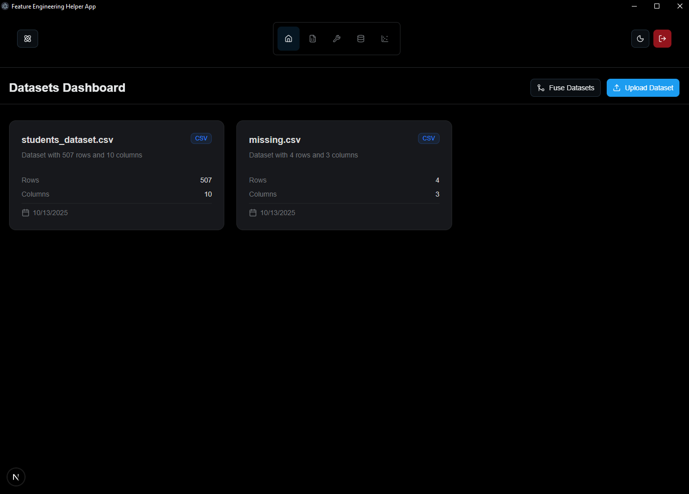
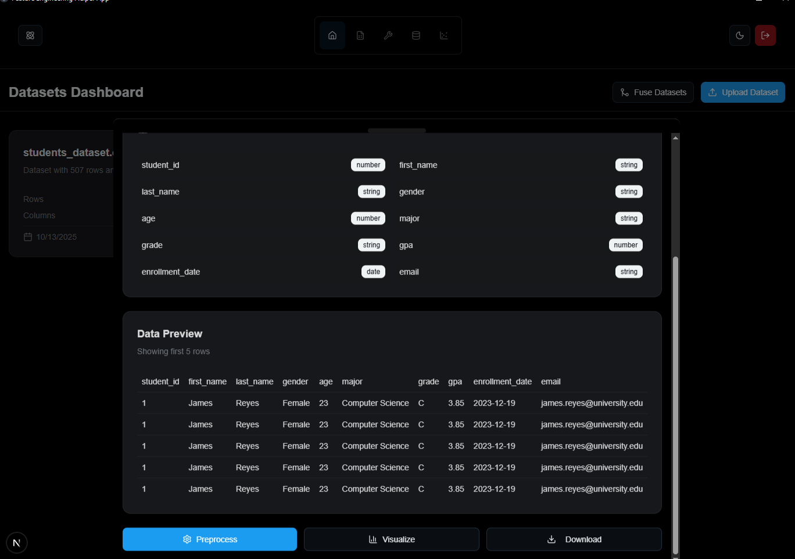
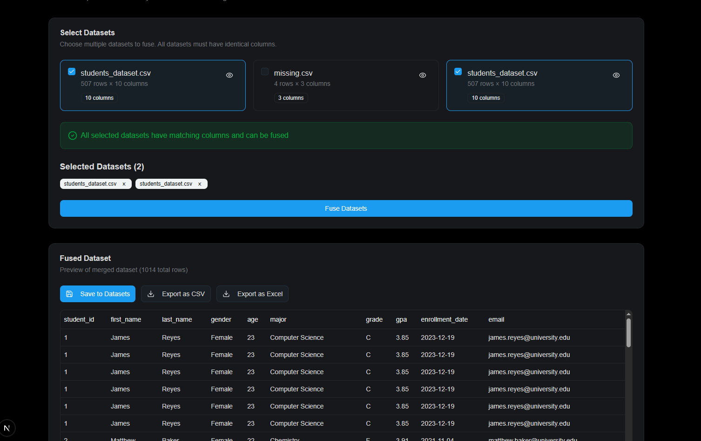
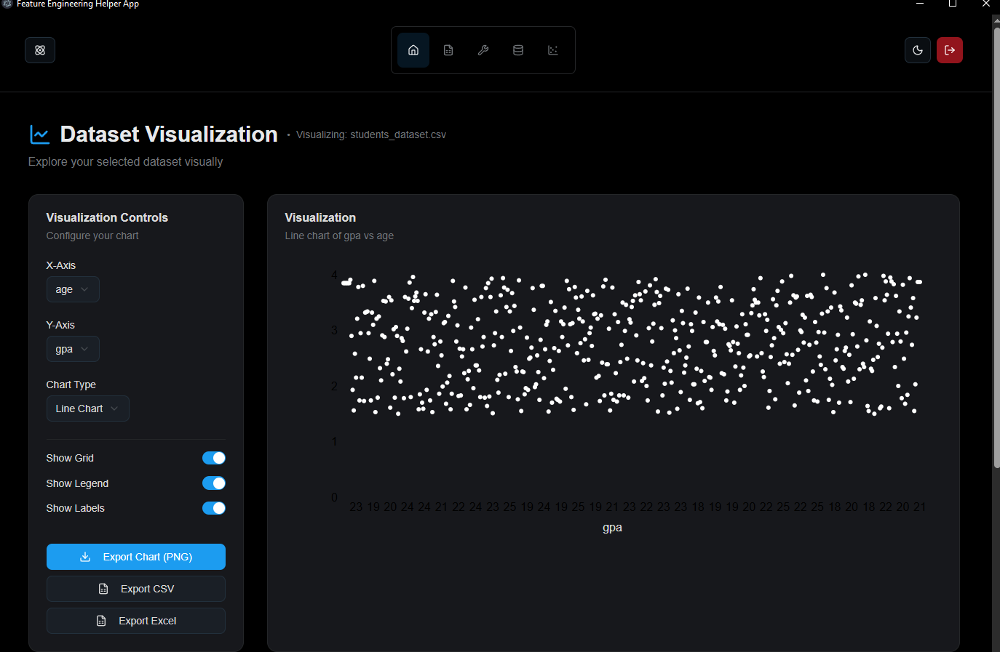
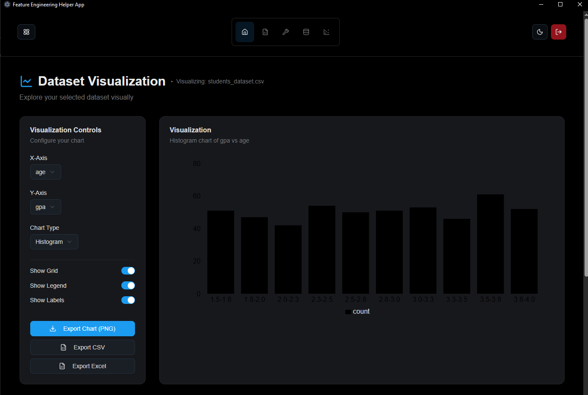

# 🚀 Feature Engineering Helper App

A powerful desktop application for **automated dataset preprocessing, visualization, and fusion** — built with **Next.js**, **FastAPI**, and **Electron**.



## 📋 Table of Contents

- [Overview](#overview)
- [Features](#features)
- [Tech Stack](#tech-stack)
- [Prerequisites](#prerequisites)
- [Installation](#installation)
- [Running the Application](#running-the-application)
- [Project Structure](#project-structure)
- [API Documentation](#api-documentation)
- [Screenshots](#screenshots)

---

## 🎯 Overview

This application helps data scientists and machine learning engineers streamline their data preprocessing workflow. Upload CSV/Excel files, apply cleaning operations, visualize insights, and fuse multiple datasets — all in an intuitive desktop interface.

---

## ✨ Features

### 🔐 User Authentication
- **Secure registration and login** with password hashing
- **Session management** with local storage

### 📊 Dataset Management
- **Upload CSV and Excel files**
- **View dataset metadata** (rows, columns, data types)
- **Dataset preview** with scrollable tables
- **Download processed datasets**

### 🛠️ Data Preprocessing (Operations)
- **Remove duplicates**
- **Handle missing values** (mean, median, mode, drop)
- **Normalization** (Min-Max scaling)
- **Standardization** (Z-score scaling)
- **Real-time preview** of cleaned data

### 🔗 Dataset Fusion
- **Merge multiple datasets** with schema validation
- **Automatic type checking** to prevent incompatible merges
- **Export fused datasets** as CSV or Excel

### 📈 Data Visualization
- **Multiple chart types**: Line, Bar, Pie, Scatter, Area, Radar, Histogram
- **Interactive controls** for X/Y axis selection
- **Export charts** as PNG images
- **Export data** as CSV or Excel

---

## 🛠️ Tech Stack

### Frontend (Client)
- **Next.js 15** - React framework with App Router
- **TypeScript** - Type-safe development
- **Tailwind CSS** - Utility-first styling
- **Shadcn/UI** - Modern UI components
- **Recharts** - Data visualization library
- **Zustand** - State management
- **Electron** - Desktop app framework
- **Framer Motion** - Animations

### Backend (Server)
- **FastAPI** - Modern Python web framework
- **SQLAlchemy** - ORM for database operations
- **Pandas** - Data manipulation and analysis
- **Scikit-learn** - Machine learning preprocessing
- **Bcrypt** - Password hashing
- **SQLite** - Database

---

## 📦 Prerequisites

Before you begin, ensure you have the following installed:

- **Node.js** (v18 or higher)
- **npm** or **yarn**
- **Python** (v3.8 or higher)
- **pip** (Python package manager)

---

## 💻 Installation

### 1. Clone the Repository

```bash
git clone https://github.com/faroukq1/feature-engineering-helper-app.git
cd feature-engineering-helper-app
```

### 2. Install Client Dependencies

```bash
cd client
npm install
```

### 3. Install Server Dependencies

```bash
cd ../server

# Create a virtual environment
python -m venv venv

# Activate the virtual environment
# On Windows:
venv\Scripts\activate
# On macOS/Linux:
# source venv/bin/activate

# Install dependencies
pip install -r requirements.txt
```

---

## 🚀 Running the Application

### Option 1: Run Both Client and Server Separately

#### Terminal 1 - Start the Backend Server

```bash
cd server

# Activate virtual environment first
# On Windows:
venv\Scripts\activate
# On macOS/Linux:
# source venv/bin/activate

# Start the server
uvicorn app.main:app --reload --port 8000
```

The API will be available at `http://localhost:8000`

#### Terminal 2 - Start the Frontend (Electron Desktop App)

```bash
cd client
npm run dev
```

This will start:
- Next.js dev server at `http://localhost:3000`
- Electron desktop app window

### Option 2: Production Build

```bash
# Build the Next.js app
cd client
npm run build

# Start production server
npm run start
```

---

## 📁 Project Structure

```
feature-engineering-helper-app/
├── client/                    # Frontend (Next.js + Electron)
│   ├── app/                   # Next.js App Router
│   │   ├── (auth)/           # Authentication pages
│   │   │   ├── login/
│   │   │   └── register/
│   │   ├── dashboard/        # Main dashboard
│   │   │   ├── create/       # Create datasets manually
│   │   │   ├── operations/   # Data preprocessing
│   │   │   ├── fusion/       # Dataset fusion
│   │   │   └── visualization/ # Data visualization
│   │   └── page.tsx          # Landing page
│   ├── components/           # Reusable UI components
│   ├── store/               # Zustand state management
│   ├── electron/            # Electron configuration
│   └── package.json
│
├── server/                   # Backend (FastAPI)
│   ├── app/
│   │   ├── main.py          # API routes and endpoints
│   │   ├── models.py        # Database models
│   │   └── database.py      # Database configuration
│   ├── downloads/           # Uploaded files storage
│   ├── database.db          # SQLite database
│   └── requirements.txt
│
├── pictures/                # Screenshots for documentation
└── README.md
```

---

## 📡 Key Features Explained

### 🔐 User Authentication


**Registration System:**
- Validates unique email addresses to prevent duplicates
- Securely hashes passwords using bcrypt before database storage
- Stores user information (first name, last name, email)
- Returns success confirmation with user ID


**Login System:**
- Authenticates users by email and password
- Verifies password against stored hash for security
- Returns user profile information upon successful login
- Maintains session through local storage

✅ **Security:** All passwords are hashed - never stored in plain text, protecting user credentials even if the database is compromised.

---

### 📊 Dataset Management




**File Upload & Processing:**
- Supports CSV and Excel (.xlsx/.xls) file formats
- Automatically detects file type and parses data
- Converts datasets to JSON format for web compatibility
- Displays dataset metadata (rows, columns, data types)
- Provides preview of first few rows
- Enables download of processed datasets

---

### 🛠️ Data Preprocessing Operations


**Available Operations:**
- **Remove Duplicates:** Eliminates duplicate rows from the dataset
- **Handle Missing Values:** Fill with mean, median, mode, or drop rows
- **Normalization:** Scales numeric values to 0-1 range (Min-Max scaling)
- **Standardization:** Centers data with mean=0 and std=1 (Z-score)
- **Real-time Preview:** See changes immediately before applying

The preprocessing pipeline automatically detects numeric columns and applies transformations safely, returning cleaned data ready for analysis or modeling.

---

### 🔗 Dataset Fusion



**Intelligent Merging:**
- Combines multiple datasets into one unified dataset
- **Schema Validation:** Ensures all datasets have matching columns and data types
- **Type Checking:** Prevents incompatible data merges
- **Diagnostics:** Provides detailed error messages if fusion fails
- **Export Options:** Save fused dataset as CSV or Excel

This feature prevents data corruption by strictly validating schema compatibility before merging datasets.

---

### 📈 Data Visualization





**Interactive Charting:**
- **Multiple Chart Types:** Line, Bar, Pie, Scatter, Area, Radar, Histogram
- **Dynamic Controls:** Select any columns for X and Y axes
- **Customization:** Toggle grid lines, legends, and labels
- **File Parsing:** Upload CSV/Excel files directly for visualization
- **Export Capabilities:** Save charts as PNG images or export data as CSV/Excel

Built with Recharts for responsive, interactive data visualization in the browser.

---

## 🤝 Contributing

Contributions are welcome! Please follow these steps:

1. Fork the repository
2. Create a new branch (`git checkout -b feature/amazing-feature`)
3. Commit your changes (`git commit -m 'Add amazing feature'`)
4. Push to the branch (`git push origin feature/amazing-feature`)
5. Open a Pull Request

---

## 📝 License

This project is open source and available under the MIT License.

---

## 👨‍💻 Author

**Farouk Q**
- GitHub: [@faroukq1](https://github.com/faroukq1)

---

## 🙏 Acknowledgments

- Built with [Next.js](https://nextjs.org/)
- Backend powered by [FastAPI](https://fastapi.tiangolo.com/)
- Desktop app with [Electron](https://www.electronjs.org/)
- UI components from [Shadcn/UI](https://ui.shadcn.com/)
- Charts by [Recharts](https://recharts.org/)

---

**⭐ If you find this project helpful, please give it a star!**
